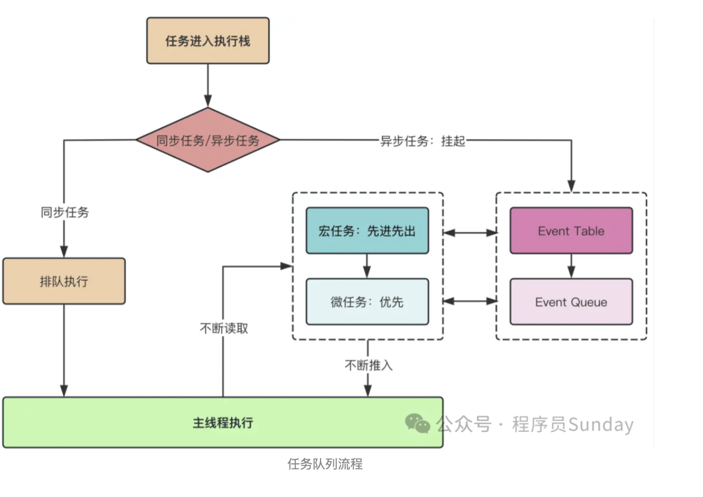
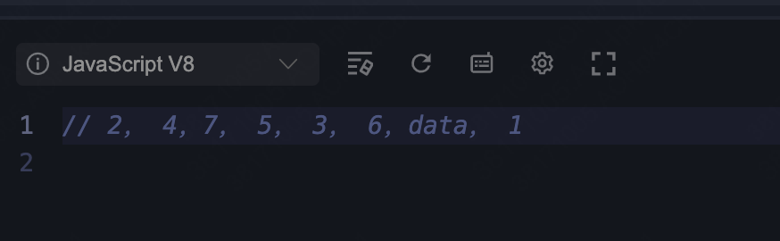

- 事件循环Event Loop

主线程（同步任务） + 任务队列
宏任务（所有的同步任务、setTimeout setInterval requestAnimation..） + 微任务(promies.then promise.cathch promise.finally \async await )
事件循环：主线程Call Stack执行完，从web Api异步队列取出微任务放到主线程执行，微任务执行完再取出宏任务，不断循环，形成事件循环


```JavaScript
  async function async1() {
    console.log('async1 start')
    await async2()
    console.log('async1 end')
  }

  async function async2() {
    console.log('async2')
  }

  console.log('script start')
  setTimeout(function () {
    console.log('settimeout')
  })
  async1()
  new Promise(function (resolve) {
    console.log('promise1')
    resolve()
  }).then(function () {
    console.log('promise2')
  })
  console.log('script end')
```

```JavaScript
  setTimeout(function () {
    console.log("1");
  }, 0);
  async function async1() {
    console.log("2");
    const data = await async2();
    console.log("3");
    return data;
  }
  async function async2() {
    return new Promise((resolve) => {
      console.log("4");
      resolve("async2的结果");
    }).then((data) => {
      console.log("5");
      return data;
    });
  }
  async1().then((data) => {
    console.log("6");
    console.log(data);
  });
  new Promise(function (resolve) {
    console.log("7");
    //   resolve()
  }).then(function () {
    console.log("8");
  });

```



- promise 


- async await