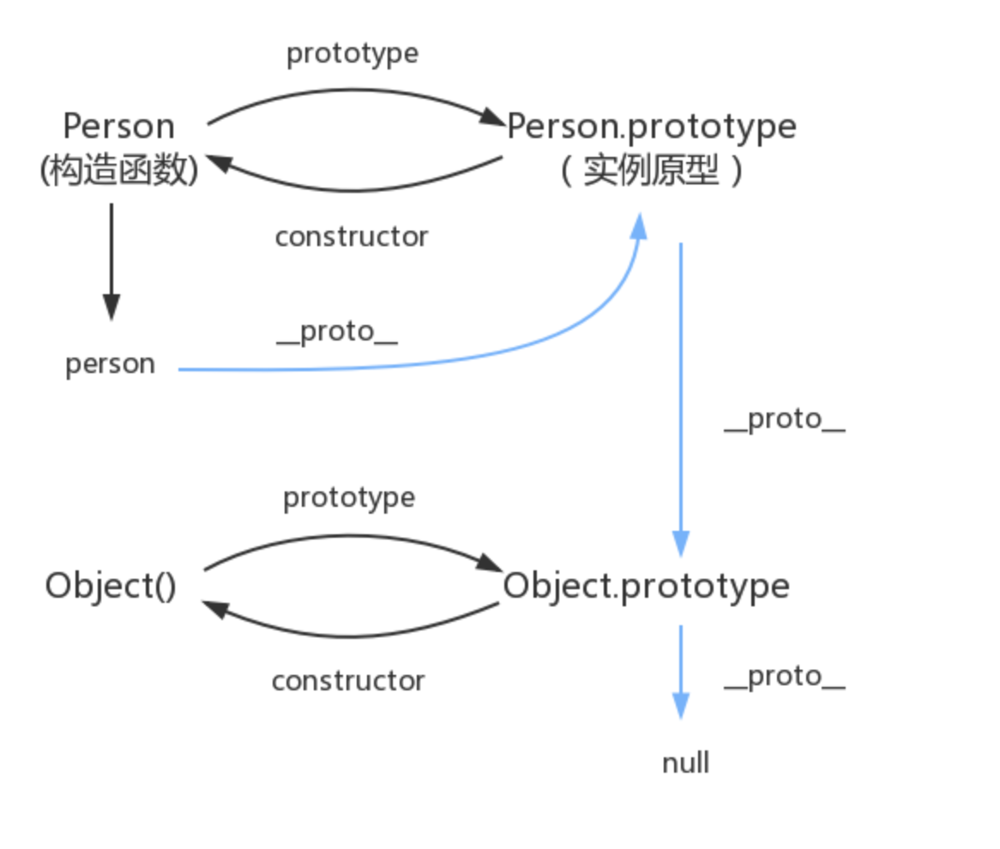

# 2 原型链


- 2.1 构造函数、实例、实例原型、原型的概念 及 关系
  F \ new F() \ __proto__\ F.prototype 
  ```javascript
    function Person() {

    }
    var person = new Person();
    person.name = 'Kevin';
    console.log(person.name) // Kevin

    // 构造函数：Person
    // 实例：person1、person2
    // 实例原型：构造函数的 prototype 属性指向了一个对象，这个对象正是调用该构造函数而【创建的实例的原型】，也就是这个例子中的 person1 和 person2 的原型。
    // 原型：每一个JavaScript对象(null除外)在创建的时候就会与之【关联】另一个对象，这个对象就是我们所说的原型，每一个对象都会从原型"继承"属性。
  ```
  - 2.1.1 prototype 实例原型
    构造函数的 prototype 属性指向了一个对象，这个对象正是【调用该构造函数而创建】的【实例的原型】
  
  - 2.1.2 __proto__
    每一个JavaScript对象(除了 null )都具有的一个属性，叫__proto__，这个属性会指向该对象的原型
    (它并不存在于 Person.prototype 中，实际上，它是来自于 Object.prototype ，与其说是一个属性，不如说是一个 getter/setter，当使用 obj.__proto__ 时，可以理解成返回了 Object.getPrototypeOf(obj))
  
  - 2.1.3 关系图
  ```JavaScript
    function Person() {

    }
    var person = new Person();
    console.log(person.__proto__ == Person.prototype) // true
    console.log(Person.prototype.constructor == Person) // true
    // 顺便学习一个ES5的方法,可以获得对象的原型
    console.log(Object.getPrototypeOf(person) === Person.prototype) // true
  ```
  - 2.1.4 实例属性的查找
    实例——>实例原型——〉原型的原型

  - 2.2 原型链
  
  - 2.3 真的是继承吗？
  JavaScript 只是在两个对象之间创建一个【关联】，这样，一个对象就可以通过委托访问另一个对象的属性和函数，所以与其叫继承，委托的说法反而更准确些

